<p align="center">
  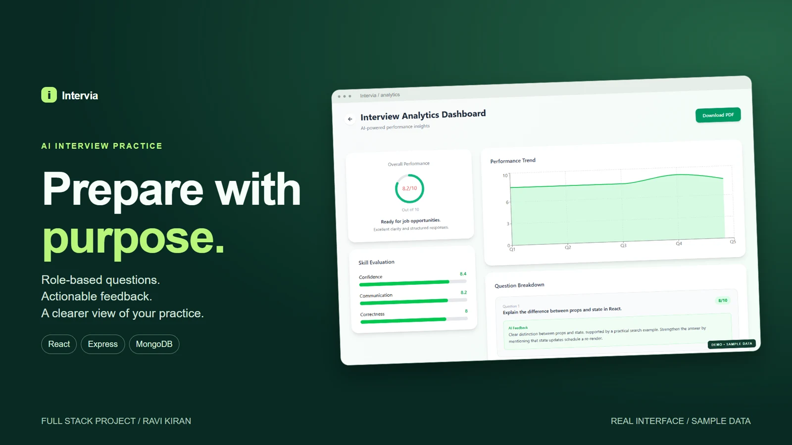
</p>

<h1 align="center">Intervia</h1>
<p align="center"><strong>Practice with context. Answer with confidence. Learn from feedback.</strong></p>
<p align="center">AI-powered interview practice with personalized questions, timed sessions, voice input, and detailed performance reports.</p>

<p align="center">
  
  
  
  
</p>

<p align="center">
  <a href="#product-tour">Product tour</a> ·
  <a href="showcase/demo/intervia-demo-1080p.mp4">Video walkthrough</a> ·
  <a href="#system-architecture">Architecture</a> ·
  <a href="#run-locally">Run locally</a> ·
  <a href="#api-reference">API reference</a>
</p>

## Overview

Intervia brings interview preparation into one repeatable workflow: set your context, practice a focused session, and review what to improve. Candidates can prepare for HR or technical interviews using their target role, experience, and optional resume as context.

The project connects a React interface to an Express API, MongoDB persistence, OpenRouter AI workflows, Firebase Google sign-in, and Razorpay credit purchases.

## Features

| Feature | What it does |
| --- | --- |
| **Personalized practice** | Generates questions from the selected role, experience, HR or technical mode, and optional resume context. |
| **Resume analysis** | Extracts PDF text and uses AI to identify role, experience, projects, and skills. Upload limit: 5 MB. |
| **Progressive sessions** | Requests five questions across easy, medium, and hard difficulty, with 60, 60, 90, 90, and 120 second answer limits. |
| **Text and voice answers** | Supports typed answers, spoken question playback, and browser speech recognition where available. |
| **Per-answer feedback** | Evaluates submitted text for confidence, communication, and correctness on a 0–10 scale, with concise feedback. |
| **Performance reports** | Displays overall results, skill averages, question scores, charts, and a downloadable PDF. |
| **Interview history** | Saves sessions and allows candidates to revisit past results. |
| **Credits and checkout** | Starts new accounts with 100 credits, charges 50 per generated session, and integrates Razorpay for additional credits. |
| **Responsive interface** | Adapts the landing page and reporting experience to desktop and mobile screens. |

## Product tour

### Set the context

Choose a role, experience level, and interview mode. Add a PDF resume to inform the questions with your background.

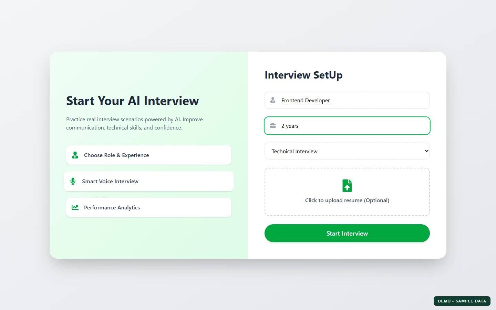

### Practice a timed interview

Work through questions with an interviewer avatar, countdown timer, text input, and microphone controls.

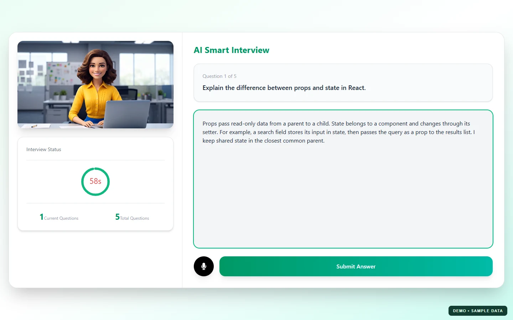

### Learn from the results

Review skill ratings, question-level feedback, and performance across the session. Export a PDF to keep a record of your preparation.

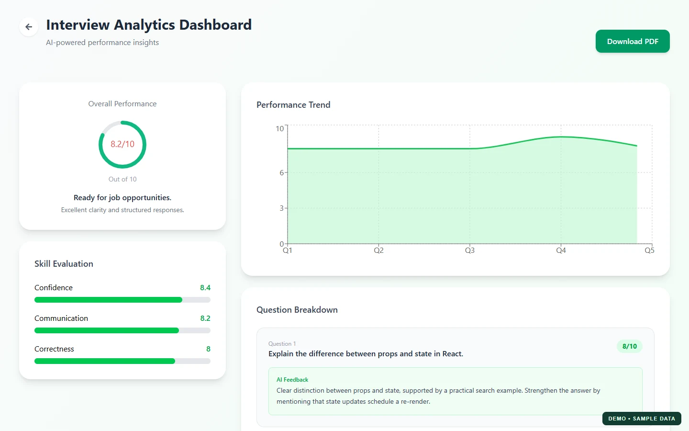

<details>
<summary><strong>More screenshots — feedback, history, pricing, and mobile</strong></summary>

#### Answer feedback

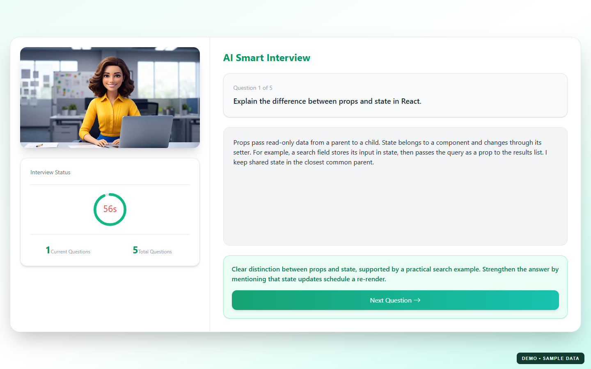

#### Question breakdown

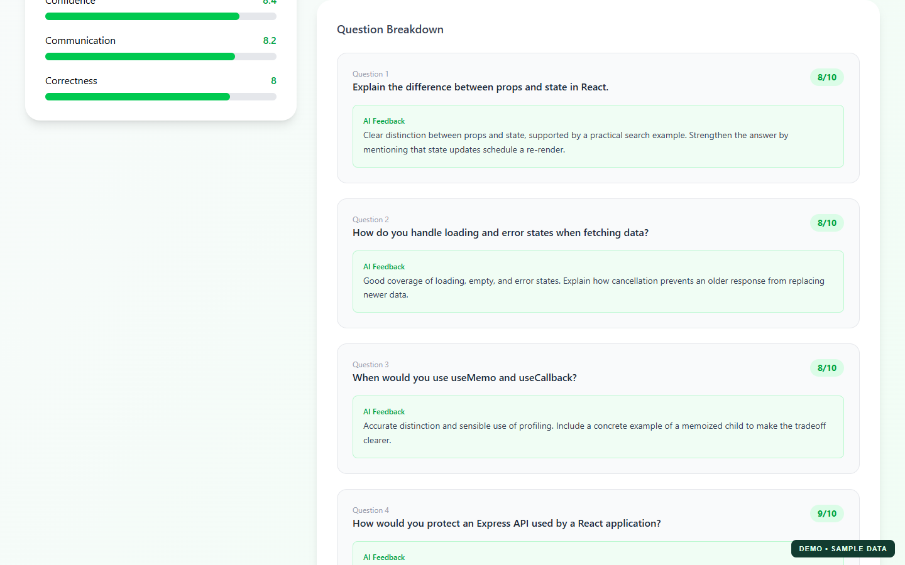

#### Interview history

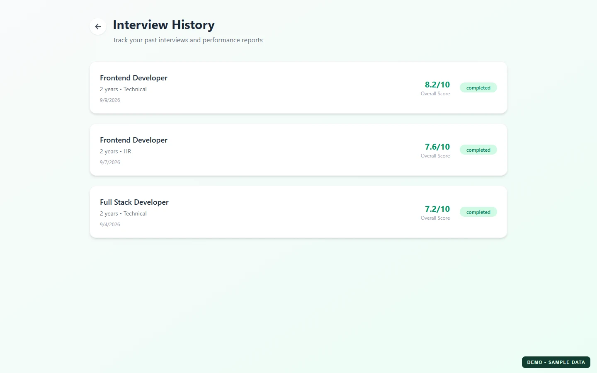

#### Credit plans

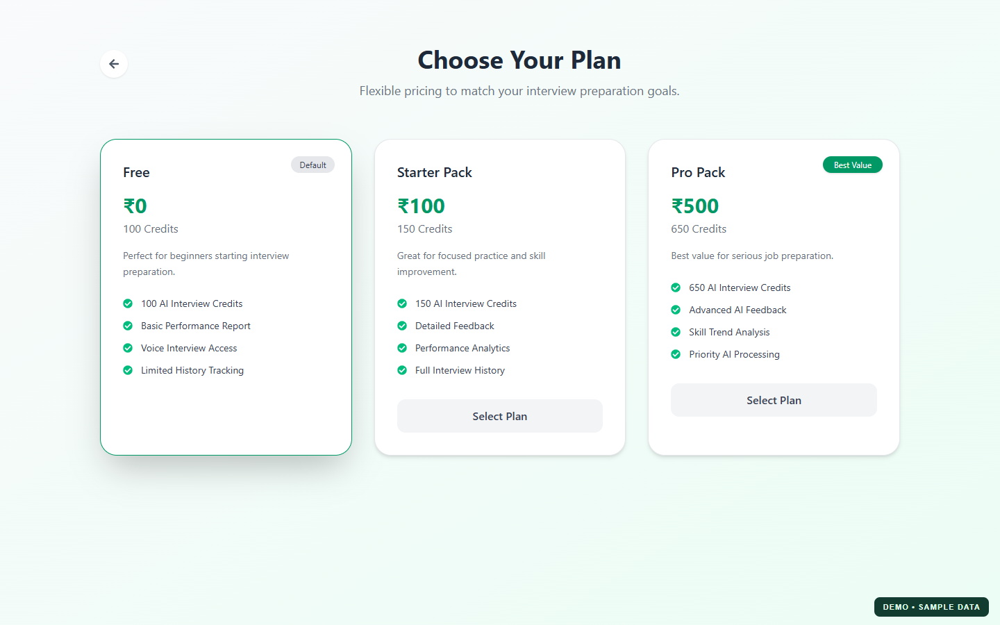

#### Mobile experience

<p align="center">
  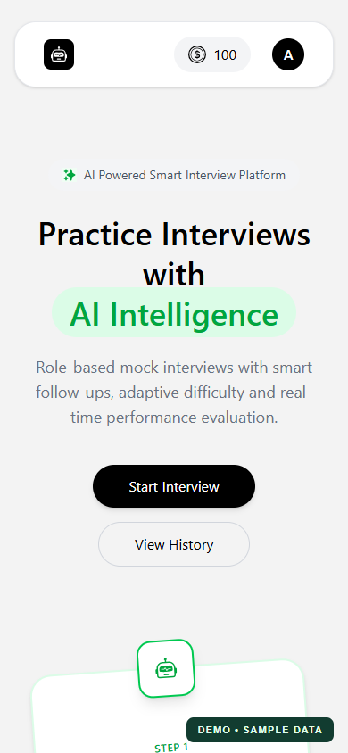
  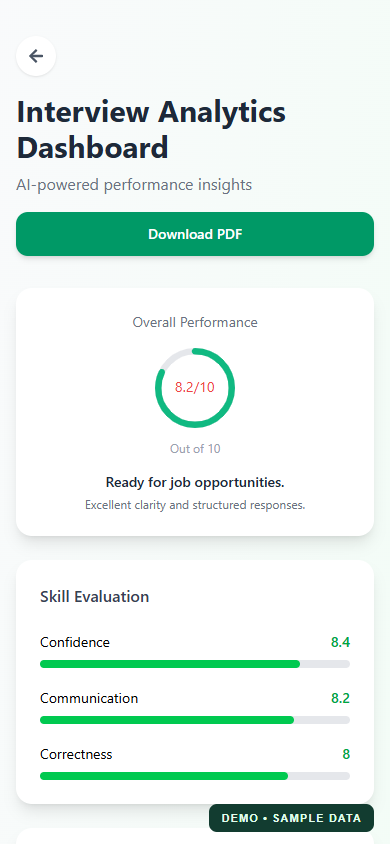
</p>

#### Landing page

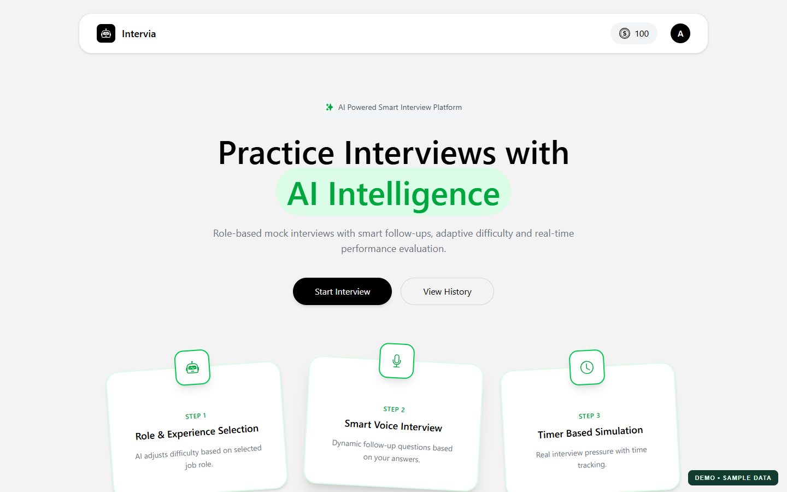

</details>

**[Watch or download the product walkthrough](showcase/demo/intervia-demo-1080p.mp4)** · [Video captions](showcase/demo/intervia-demo.vtt)

The supplied media captures the actual React interface with illustrative sample data. The silent video demonstrates one answer and then opens a saved sample report; API responses and speech events are simulated. During media preparation, a separate capture run exercised all five questions and PDF download. These captures demonstrate the client experience, not live provider or payment validation.

## System architecture

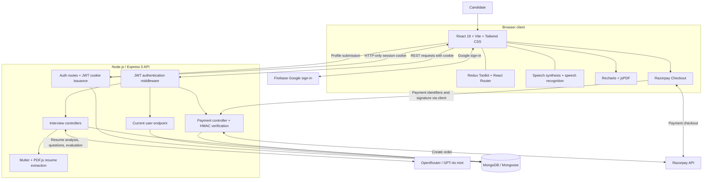

The browser handles interaction, speech features, charts, and PDF export. Express coordinates AI requests, session records, resume parsing, and payments. MongoDB stores users, embedded interview questions and results, and payment records.

### Interview lifecycle

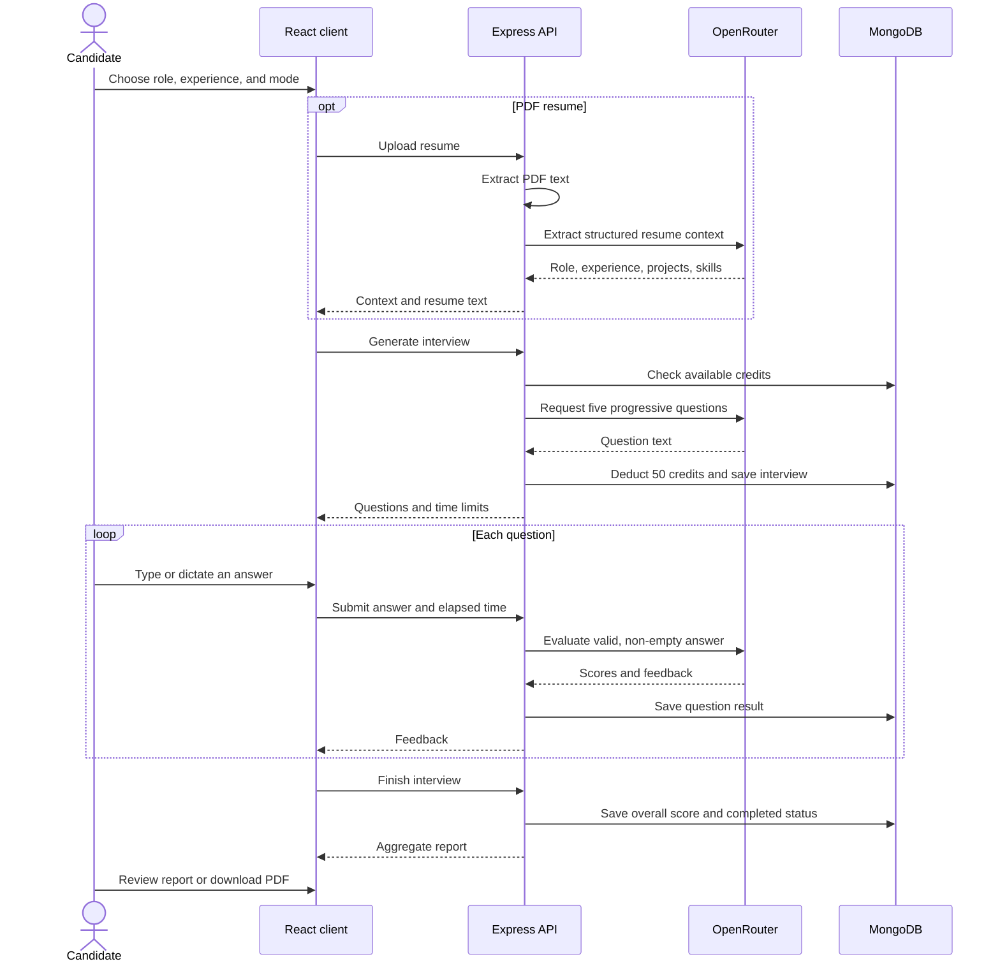

The model is configured as `openai/gpt-4o-mini` in [the OpenRouter service](server/services/openRouter.service.js). Resume extraction, question generation, and answer evaluation use separate prompts. Empty answers and answers exceeding the time limit receive zero scores without AI evaluation. Confidence and communication are ratings of submitted text; the implementation does not analyze vocal tone or generate adaptive follow-up questions.

### Data model

| Collection | Stored information | Relationship |
| --- | --- | --- |
| `User` | Name, unique email, credit balance, timestamps | One user can have many interviews and payments. |
| `Interview` | Role, experience, mode, resume text, embedded questions, answers, feedback, scores, status, timestamps | References `User` through `userId`. |
| `Payment` | Plan, amount, credits, Razorpay identifiers, status, timestamps | References `User` through `userId`. |

## Technology stack

| Layer | Technologies |
| --- | --- |
| Frontend | React 19, Vite 7, Tailwind CSS 4, Motion, React Icons |
| State and navigation | Redux Toolkit, React Redux, React Router 7 |
| API | Node.js, Express 5, Axios, CORS, cookie-parser |
| Persistence | MongoDB, Mongoose 9 |
| AI | OpenRouter chat completions, GPT-4o mini |
| Authentication | Firebase Google sign-in, JSON Web Tokens, HTTP-only cookies |
| Resume processing | Multer, PDF.js (`pdfjs-dist`) |
| Reporting | Recharts, react-circular-progressbar, jsPDF, jspdf-autotable |
| Payments | Razorpay, server-side HMAC SHA-256 verification |

## Run locally

### Prerequisites

- Node.js **22.13+ within the 22.x release line**, compatible with the server engine range and dependency requirements.
- npm and a reachable MongoDB database.
- A Firebase project with Google sign-in enabled.
- An OpenRouter API key.
- Razorpay test credentials. The Razorpay client initializes when the API starts, so configure these even when only exploring non-payment features.

### 1. Clone and install

```bash
git clone https://github.com/Ravi-rk7/Intervia.git
cd Intervia
npm ci --prefix client
npm ci --prefix server
```

### 2. Configure the environment

Copy `server/.env.example` to `server/.env` and `client/.env.example` to `client/.env`, then fill in your configuration.

**Server — `server/.env`**

| Variable | Value or purpose |
| --- | --- |
| `PORT` | `8000` for the default local client configuration. |
| `NODE_ENV` | `development` locally; `production` for secure production cookies. |
| `CLIENT_URL` | `http://localhost:5173`; supports comma-separated allowed origins. |
| `MONGODB_URL` | Your MongoDB connection string. |
| `JWT_SECRET` | A strong secret for signing API session tokens. |
| `OPENROUTER_API_KEY` | Your OpenRouter API key. |
| `RAZORPAY_KEY_ID` | Your Razorpay test key ID. |
| `RAZORPAY_KEY_SECRET` | The corresponding server-only key secret. |

**Client — `client/.env`**

| Variable | Value or purpose |
| --- | --- |
| `VITE_FIREBASE_APIKEY` | Firebase web API key for your project. |
| `VITE_RAZORPAY_KEY_ID` | Public Razorpay key ID matching the server configuration. |
| `VITE_SERVER_URL` | Optional API origin. Defaults to `http://localhost:8000` in development and same-origin requests in production. |

Update the remaining Firebase project settings in [client/src/utils/firebase.js](client/src/utils/firebase.js) to match your project, enable the Google authentication provider, and configure the domains used for sign-in. The repository currently includes a specific project's Firebase settings.

Keep private credentials in the server environment. Variables prefixed with `VITE_` are included in the client bundle; `.env` files are excluded by `.gitignore`.

### 3. Start both services

Run the API in one terminal:

```bash
cd server
npm run dev
```

Run the frontend in a second terminal from the repository root:

```bash
cd client
npm run dev
```

Open **http://localhost:5173**. The API health endpoint is **http://localhost:8000/api/health**. If `PORT` is omitted, the server falls back to `6000`; the example environment sets it to `8000` to match the client.

### 4. Try the workflow

1. Continue with Google and receive the initial 100-credit balance.
2. Start an HR or technical interview and enter your role and experience.
3. Optionally analyze a PDF resume, then generate the session.
4. Type your answers or use speech recognition where supported, submitting within each timer.
5. Review feedback, finish the session, and export the report as PDF.
6. Revisit your results through Interview History.

Voice input uses `webkitSpeechRecognition` with `en-US`. Availability depends on the browser and microphone permission; text input remains available.

## API reference

All paths are relative to the API origin. Protected routes expect the JWT session cookie; the client sends requests with credentials enabled.

| Method | Endpoint | Session required | Purpose |
| --- | --- | --- | --- |
| `GET` | `/api/health` | No | API health response. |
| `POST` | `/api/auth/google` | No | Accept profile data and create an API session. |
| `GET` | `/api/auth/logout` | No | Clear the session cookie. |
| `GET` | `/api/user/current-user` | Yes | Fetch the current user and credit balance. |
| `POST` | `/api/interview/resume` | Yes | Analyze a multipart PDF upload using field `resume`. |
| `POST` | `/api/interview/generate-questions` | Yes | Generate questions and create an interview. |
| `POST` | `/api/interview/submit-answer` | Yes | Evaluate and save a question answer. |
| `POST` | `/api/interview/finish` | Yes | Complete the interview and return aggregate results. |
| `GET` | `/api/interview/get-interview` | Yes | List the current user's interviews, newest first. |
| `GET` | `/api/interview/report/:id` | Yes | Retrieve a saved report. |
| `POST` | `/api/payment/order` | Yes | Create a Razorpay order and payment record. |
| `POST` | `/api/payment/verify` | Yes | Verify a payment signature and credit the account. |

## Credits and payments

Each generated interview costs **50 credits**. The pricing page defines these bundles:

| Plan | Price in the application | Credits | Sessions at 50 credits each |
| --- | --- | --- | --- |
| Free | ₹0 | 100 on account creation | 2 |
| Starter Pack | ₹100 | 150 | 3 |
| Pro Pack | ₹500 | 650 | 13 |

Checkout creates an order through the API, opens Razorpay in the browser, and submits the returned payment identifiers and signature for server-side verification. The server compares an HMAC SHA-256 signature before marking the payment paid and adding credits, and checks whether a payment is already marked paid.

## Project structure

```text
Intervia/
├── client/
│   ├── public/               # Public static assets
│   ├── src/
│   │   ├── assets/           # Illustrations and interviewer videos
│   │   ├── components/       # Setup, interview, report, and shared UI
│   │   ├── pages/            # Home, auth, history, pricing, and reports
│   │   ├── redux/            # User state and store
│   │   ├── utils/            # Firebase configuration
│   │   └── App.jsx           # Routes and API origin
│   ├── .env.example
│   └── vercel.json           # API proxy and SPA rewrites
├── server/
│   ├── config/               # Database connection and JWT creation
│   ├── controllers/          # Auth, interview, payment, and user logic
│   ├── middlewares/          # JWT checks and temporary file uploads
│   ├── models/               # User, Interview, and Payment schemas
│   ├── routes/               # Express routes
│   ├── services/             # OpenRouter and Razorpay clients
│   ├── .env.example
│   └── index.js              # API bootstrap and CORS configuration
├── showcase/                 # Repository-local screenshots and demo
└── README.md
```

## Scripts and deployment configuration

| Directory | Command | Purpose |
| --- | --- | --- |
| `client` | `npm run dev` | Start the Vite development server. |
| `client` | `npm run build` | Build the frontend into `client/dist`. |
| `client` | `npm run preview` | Preview the frontend build locally. |
| `client` | `npm run lint` | Run ESLint. |
| `server` | `npm run dev` | Run Express with nodemon. |
| `server` | `npm start` | Run Express with Node.js. |

[client/vercel.json](client/vercel.json) contains an `/api` proxy to a Render backend and a fallback for client-side routing. For your own deployment, replace the proxy destination with your API URL, configure the server's `CLIENT_URL`, and provide the appropriate environment variables. A blank production `VITE_SERVER_URL` uses this same-origin proxy; setting it explicitly makes the browser call that API origin directly. Use `NODE_ENV=production` and HTTPS for production session cookies.

### Implementation boundaries

The current Google auth endpoint accepts client-submitted name and email without verifying a Firebase ID token on the server. Interview lookup handlers also need ownership checks, and payment order amounts and credits currently come from the request body. Server-side identity verification, resource authorization, authoritative plan validation, and atomic credit/payment updates are outstanding work before a public production launch.

The application packages currently define no automated test script. Checks performed during showcase preparation covered sample client flows and PDF export; they did not validate real authentication, AI responses, database operations, or payments. The repository includes the final showcase media; media-generation tooling is maintained separately.

## Author

Built by **[Ravi Kiran](https://github.com/Ravi-rk7)**.

For bugs or ideas, [open an issue](https://github.com/Ravi-rk7/Intervia/issues) with a clear description and reproduction steps where applicable.
