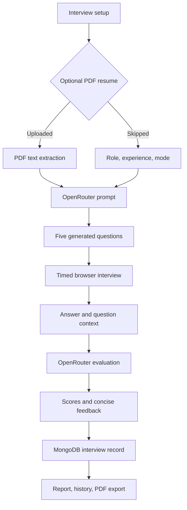
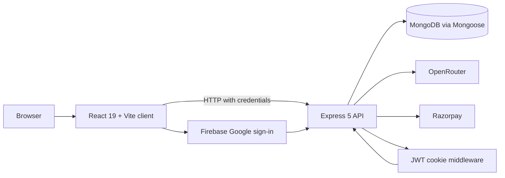

# Intervia

### AI-powered interview practice that feels like the real thing.

Intervia is a full-stack interview practice platform for candidates preparing for HR and technical interviews. It combines role-based question generation, optional resume context, a timed voice-enabled interview experience, per-answer AI feedback, and persistent performance reports.

<p align="center">
  <a href="https://github.com/Ravi-rk7/Intervia">Repository</a>
  ·
  <a href="#getting-started">Run locally</a>
  ·
  <a href="#usage">Usage</a>
</p>

> This README describes the current repository state. There is no verified public deployment, demo video, or open-source license in the repository at this time.

## Product preview

The repository includes the following checked-in product illustrations used by the landing page:

<p align="center">
  
  
  
</p>

Captured browser screenshots were not added because browser automation was unavailable in the execution environment. No synthetic screenshots are included.

## What is Intervia?

Interview preparation is often built around static question lists and feedback that is difficult to personalize. Intervia turns preparation into a repeatable practice loop:

1. Sign in with Google.
2. Choose an interview role, experience level, and mode.
3. Optionally upload a PDF resume for AI-assisted context extraction.
4. Complete a five-question, timed interview with browser voice features.
5. Review scores, per-question feedback, skill ratings, and a downloadable PDF report.
6. Revisit completed sessions from interview history.

## Core capabilities

| Capability | Current implementation |
| --- | --- |
| HR and technical modes | Interview setup stores either `HR` or `Technical`. |
| Role-based questions | OpenRouter generates exactly five questions with easy-to-hard progression. |
| Resume context | Uploaded PDFs are parsed on the server and summarized into role, experience, projects, and skills. |
| Voice-enabled session | Browser speech synthesis reads questions aloud; browser speech recognition can transcribe answers when supported. |
| Timed answers | Questions use 60, 60, 90, 90, and 120 second limits. |
| AI evaluation | Each answer is scored for confidence, communication, and correctness on a 0–10 scale. |
| Reports | Overall score, skill averages, question breakdown, feedback, charts, and PDF export. |
| History | Completed and in-progress interviews are persisted in MongoDB and listed newest first. |
| Credits | New users receive 100 credits; generating an interview consumes 50 credits. |
| Credit purchases | Razorpay order creation and HMAC signature verification add purchased credits. |

## How the AI pipeline works



The server centralizes AI requests in `server/services/openRouter.service.js` and currently calls the OpenRouter chat completions endpoint with `openai/gpt-4o-mini`. Interview generation and answer evaluation are separate prompt flows. Results are written into the interview document, including question-level scores, feedback, and aggregate metrics.

## Architecture



The client is served by Vite on port `5173` during development. The API uses Express routes under `/api`, with protected interview, user, and payment endpoints. The server defaults to port `6000`, while this repository's client is configured to call `http://localhost:8000`; use `PORT=8000` for the documented local setup.

## Technology stack

| Technology | Purpose |
| --- | --- |
| React 19 | Component-based client UI |
| Vite | Client development server and production build tooling |
| Tailwind CSS 4 | Utility-first styling |
| Redux Toolkit | User session and credit state |
| React Router | Client-side routes for home, auth, interview, history, pricing, and reports |
| Firebase Authentication | Google sign-in in the browser |
| Node.js and Express 5 | REST API runtime and route layer |
| MongoDB and Mongoose | User, interview, and payment persistence |
| OpenRouter | LLM access for resume extraction, question generation, and evaluation |
| `pdfjs-dist` and Multer | PDF upload handling and server-side resume text extraction |
| Razorpay | Credit purchase checkout and payment verification |
| JWT and cookies | Protected API sessions |
| Recharts and jsPDF | Report charts and downloadable PDF reports |

## Project structure

```text
Intervia/
├── client/
│   ├── src/
│   │   ├── components/       # Setup, live interview, report, navigation, shared UI
│   │   ├── pages/            # Home, auth, interview, history, pricing, report routes
│   │   ├── redux/            # Store and user slice
│   │   ├── assets/           # Landing illustrations and interview videos
│   │   └── utils/            # Firebase client configuration
│   ├── package.json
│   └── vite.config.js
├── server/
│   ├── controllers/          # Auth, interview, user, and payment logic
│   ├── models/               # User, interview, and payment schemas
│   ├── routes/               # Express API routes
│   ├── services/             # OpenRouter and Razorpay clients
│   ├── middlewares/           # Auth and file-upload middleware
│   ├── config/               # MongoDB and JWT configuration
│   └── package.json
├── docs/
│   └── progress/             # Development progress notes
└── README.md
```

## Getting started

### Prerequisites

- Node.js and npm
- A MongoDB database
- Firebase Authentication configured for Google sign-in
- An OpenRouter API key
- Razorpay test or live credentials if payment flows are needed

### Clone and install

```bash
git clone https://github.com/Ravi-rk7/Intervia.git
cd Intervia

cd client
npm install

cd ../server
npm install
```

### Configure environment variables

Create `server/.env`:

| Variable | Description | Required |
| --- | --- | --- |
| `PORT` | API port; use `8000` with the current client configuration | Yes |
| `MONGODB_URL` | MongoDB connection string | Yes |
| `JWT_SECRET` | Secret used to sign session cookies | Yes |
| `OPENROUTER_API_KEY` | OpenRouter API credential | Yes |
| `RAZORPAY_KEY_ID` | Server-side Razorpay key ID | Required for payments |
| `RAZORPAY_KEY_SECRET` | Server-side Razorpay signing secret | Required for payments |

Create `client/.env`:

| Variable | Description | Required |
| --- | --- | --- |
| `VITE_FIREBASE_APIKEY` | Firebase web API key used by the client configuration | Yes |
| `VITE_RAZORPAY_KEY_ID` | Public Razorpay key used to open checkout | Required for payments |

The remaining Firebase settings are currently read from `client/src/utils/firebase.js`. Do not commit `.env` files, API keys, tokens, payment credentials, or database credentials.

### Run locally

Start the API in one terminal:

```bash
cd server
npm run dev
```

Start the client in a second terminal:

```bash
cd client
npm run dev
```

Open [http://localhost:5173](http://localhost:5173). The client currently sends API requests to `http://localhost:8000`.

### Available scripts

From `client/`:

```bash
npm run dev       # Start Vite
npm run build     # Create a production build
npm run lint      # Run ESLint
npm run preview   # Preview the production build
```

From `server/`:

```bash
npm run dev       # Start Express with nodemon
```

## Usage

1. Open the app and continue with Google.
2. Start an interview and provide a role, experience level, and mode.
3. Optionally upload and analyze a PDF resume.
4. Start the generated five-question session.
5. Use the microphone controls if your browser supports speech recognition; the questions are also displayed as text.
6. Submit each answer before its timer expires.
7. Review the report and download the generated PDF.
8. Open Interview History later to revisit saved reports.
9. Buy additional credits from Pricing when the account balance is insufficient.

## Authentication and security

- Google identity is established through Firebase on the client.
- The API creates a JWT and stores it in a cookie after Google sign-in.
- Interview, user, and payment routes use the `isAuth` middleware to verify the JWT.
- Server credentials are loaded from environment variables.
- Uploaded resume files are processed temporarily and removed after extraction or failure.
- Razorpay payments are verified server-side with an HMAC SHA-256 signature before credits are added.
- CORS is configured for the local Vite origin with credentials enabled.

This repository does not currently implement password authentication, rate limiting, or a general-purpose request-validation layer.

## Payments and credits

The pricing page exposes a free plan plus paid Starter Pack and Pro Pack credit bundles. The paid flow is:

```text
Select plan → API creates Razorpay order → Razorpay checkout
    → API verifies order/payment signature → payment marked paid
    → purchased credits added to the user
```

The server stores payment status and Razorpay identifiers in MongoDB. Never expose `RAZORPAY_KEY_SECRET` or any other private credential to the client.

## Engineering highlights

- Full-stack React, Express, and MongoDB application
- Modular client pages and interview-step components
- REST APIs with protected routes and cookie-based JWT sessions
- LLM integration for structured resume extraction, question generation, and scoring
- Persistent question-level interview records and aggregate reports
- Browser speech APIs integrated into a timed interview workflow
- Server-side PDF parsing and client-side PDF report generation
- Credit accounting and verified Razorpay payment workflow
- Environment-based configuration for external services

## Roadmap

### Implemented

- Landing page and authenticated navigation
- Google sign-in flow
- HR and technical interview setup
- Optional resume PDF analysis
- Five-question timed interview sessions
- Voice playback and browser speech recognition integration
- AI scoring and report visualization
- Interview history and PDF export
- Razorpay credit purchase flow
